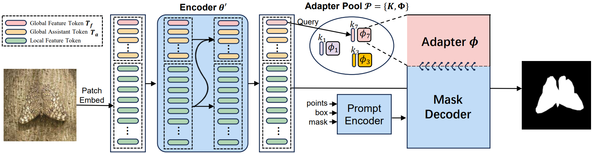
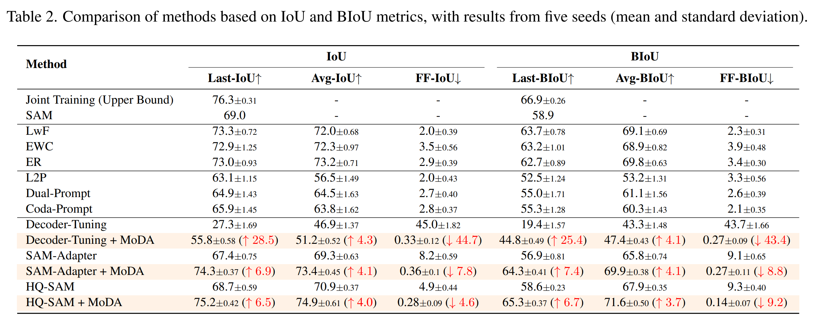

# Continual Learning for Segment Anything Model Adaptation

This paper introduces the CoSAM Benchmark for evaluating Segment Anything Model (SAM) adaptation algorithms in a Continual Learning framework and proposes the Mistrue of Domain Adapters (MoDA) method to help the SAM encoder extract well-separated features for different task domains, and
then enable adapters to learn task-specific information for continual learning.

## Installation

To set up a local development environment, follow these steps:

```bash
# Clone the repository
git clone https://github.com/yourusername/CoSAM.git


# Navigate to the project directory
cd CoSAM

# Install Segment Anything
pip install git+https://github.com/facebookresearch/segment-anything.git
```


## Preparation

### Download Datasets
https://drive.google.com/file/d/1YC0u1LNrq26167XQILXisQpj1-vA1jQ6/view?usp=drive_link


### Download Pre-Trained Checkpoints
Pre-trained SAM
https://drive.google.com/file/d/11yExZLOve38kRZPfRx_MRxfIAKmfMY47/view?usp=drive_link

Pre-trained HQ-SAM Decoder
https://drive.google.com/file/d/1cwieLjTZZCYcTdzYvOKq2UC__e_B9QN9/view?usp=drive_link

## Train


```bash
# Joint-Training
python -m torch.distributed.launch --nproc_per_node=1 train_CL.py
# Lwf
python -m torch.distributed.launch --nproc_per_node=1 train_CL.py --CLmethod lwf --distill_weight 3
# ER
python -m torch.distributed.launch --nproc_per_node=1 train_CL.py --CLmethod er
# EWC
python -m torch.distributed.launch --nproc_per_node=1 train_CL.py --CLmethod ewc --ewc_weight 10
# L2P
python -m torch.distributed.launch --nproc_per_node=1 train_CL.py --CLmethod l2p
# HQ-SAM (Naive sequential training)
python -m torch.distributed.launch --nproc_per_node=1 train_CL.py --CLmethod naive
# HQ-SAM + MoDA(ours)
python -m torch.distributed.launch --nproc_per_node=1 train_adapter_pool.py --buffer_size 10

```

## Evaluate
```bash
# L2P
python -m torch.distributed.launch --nproc_per_node=1 train_CL.py --eval --CLmethod l2p --restore-model "saved_ckpt"
# HQ-SAM + MoDA (ours)
python -m torch.distributed.launch --nproc_per_node=1 train_adapter_pool.py --eval
# Others
python -m torch.distributed.launch --nproc_per_node=1 train_CL.py --eval --restore-model "saved_ckpt"
```

## Results



